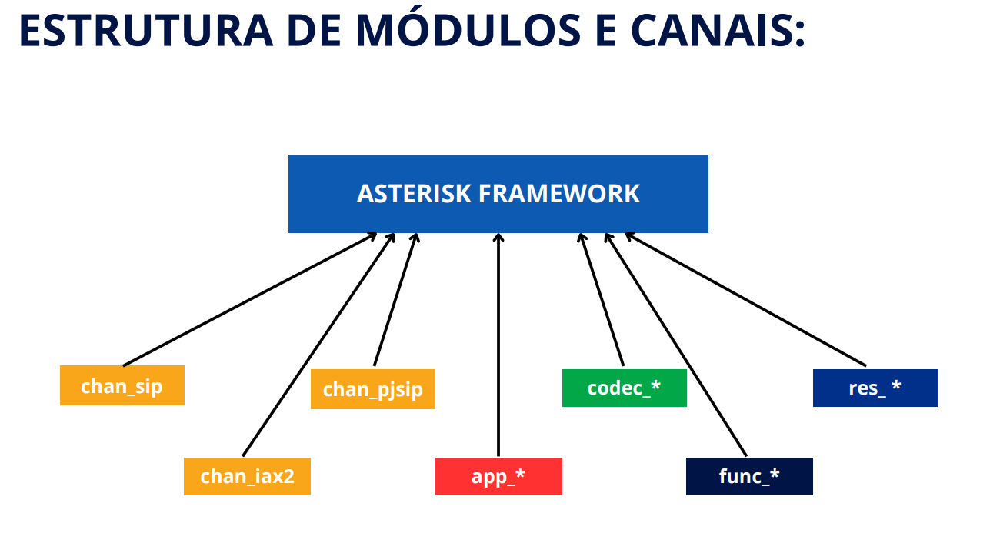

s# **Asterisk Básico**
<br>

> ### **Estrutura de diretórios**

```sql
1 - /etc/asterisk - Fala do diretorio de configuração do asterisk e dos samples


2- /usr/lib/asterisk - diretorio de modulos, /*raramente se mexe, apenas qdo add modulos - ex: add codec mas é bom pra ver se o modulo de existe*/

3- /var/log/asterisk - pasta de logs

4 /var/lib/asterisk/

4.1 - /var/lib/asterisk/agi-bin - scripts de agi - asterisk

5 - /var/lib/asterisk/sounds - arquivos de audios /* bom colocar os audios da ura aqui como boa pratica*/

6 - /var/spool/asterisk

monitor -> arquivo de gravação de chamadas
outgoing -> diretorio de disparo callfile
voicemail -> arquivo com as mensagens da caixa postal
recording -> gravação de arquivos com o record de forma dinamico


7 - Como mudar os diretorios
/etc/asterisk/asterisk.conf

```
<br>
<br>

> ### **Cli do Asterisk**

```txt
O asterisk é um serviço que roda em background e voce pode acessar a console desse serviço

Existem duas formas:

asterisk -r ou rasterisk

ctrl+c nao mata, exceto se voce nao subir como background

Como subir na mão: asterisk -vvvvvcf

mostrar o auto-complete

core show channels

core show uptime

module reload 

Atalhos:
sip reload
queue reload

reload reinicia todos


Comandos mais usados:
core show channels
core show channel
core show uptime
core set verbose X
dialplan show
sip show peers
pjsip show **


```

<br>

> ### **Canais do asterisk**


<br>

> ### **Contexto de Configuração**

Os blocos de configurações no Asterisk tem uma particularidade que é sempre iniciar com colchetes:

Um contexto termina quando o outro contexto inicia:

```sql
[contextodeconfi]
info1=1
info2=2

[contexto1]
...configs do contexto1...
[contexto2]
...configs do contexto2...
```

Ou seja, todo bloco de configuração pode ser denominado um contexto de configuração e o que vai mudar de um caso para o outro é o conteúdo do contexto.

<br>

> ### **Conceitos do PJSIP**

TIPOS DE CONTEXTO PJSIP:

- **endpoint:** Representa um terminal SIP: pode ser um ramal,um softphone, uma operadora, etc.
- **aor:** Significa Address of Record. Define onde e como contatar o endpoint (ex: IP, host, quantidade de Contatos).
- **auth:** Define credenciais (usuário e senha) para autenticação SIP.
- **registration:** Usado quando o Asterisk precisa se registrar em outro servidor SIP (como numa operadora).
- **transport:** Define as opções de transporte: UDP, TCP, TLS, WebSocket, etc.
- **identify:** Liga um IP remoto a um endpoint (para chamadas entrantes).
- **global:** Parâmetros globais da stack PJSIP.
- **system:** É usado para ajustar performance do core do PJSIP.
- **acl:** É utilizado para regra gerais de entrada de trafego no Asterisk, independentemente da camada.
- **domain_alias:** Ele faz um alias (um link) entre 2 dominios e pode ser usado para referenciar em buscas do AoR.

<br>

> ### **Pjsip Ramais**

Exemplo:

**Arquivo /etc/asterisk/pjsip.conf**

```bash
[global]
type=global
user_agent=Asterisk
endpoint_identifier_order=username,ip,anonymous

[transport-udp-nat]
type=transport
protocol=udp
bind=0.0.0.0:5060

[1000]
type=auth
auth_type=userpass
username=1000
password=123123

[1001]
type=auth
auth_type=userpass
username=1001
password=123123

[1000]
type=aor
max_contacts=2
qualify_frequency=30

[1001]
type=aor
max_contacts=2 # Quantidade Máxima de "registros"

[1000]
type=endpoint
aors=1000
auth=1000
context=ramais
disallow=all
allow=alaw,ulaw

rewrite_contact=yes # Permite que o cabeçalho sip seja reescrito.

rtp_symmetric=yes # Quando ativado, o Asterisk ignora o IP/porta informados no SDP do outro lado e passa a enviar o RTP exatamente para o mesmo IP e porta de onde ele recebeu o áudio.

force_rport=yes # força porta randômica “Ignore a porta SIP anunciada pelo endpoint e responda para a mesma IP/porta de onde o SIP veio.”

direct_media=no #“Não tire o Asterisk do caminho do áudio. Todo o RTP passa por ele.”

transport=transport-udp-nat

[1001]
type=endpoint
aors=1001
auth=1001
context=ramais
disallow=all
allow=alaw,ulaw
rewrite_contact=yes
rtp_symmetric=yes
force_rport=yes
direct_media=no
transport=transport-udp-nat

```
<br><br>

> ### **PJsip Troncos**

1. Tronco por IP

```bash
[global]
type=global
user_agent=Asterisk
endpoint_identifier_order=username,ip,anonymous

[transport-udp-nat]
type=transport
protocol=udp
bind=0.0.0.0:5060

[1000]
type=auth
auth_type=userpass
username=1000
password=123123

[1001]
type=auth
auth_type=userpass
username=1001
password=123123

[1000]
type=aor
max_contacts=2

[1001]
type=aor
max_contacts=2

[1000]
type=endpoint
aors=1000
auth=1000
context=ramais
disallow=all
allow=alaw,ulaw
rewrite_contact=yes
rtp_symmetric=yes
force_rport=yes
direct_media=no
transport=transport-udp-nat

[1001]
type=endpoint
aors=1001
auth=1001
context=ramais
disallow=all
allow=alaw,ulaw
rewrite_contact=yes
rtp_symmetric=yes
force_rport=yes
direct_media=no
transport=transport-udp-nat

#############

[operadoravoip]
type=endpoint
context=incoming
disallow=all
allow=alaw,ulaw
transport=transport-udp-nat
aors=operadoravoip
direct_media=no
force_rport=yes

[operadoravoip]
type=aor
contact=sip:sip.operadora.net:5060

[operadoravoip]
type=identify
endpoint=operadoravoip
match=sip.operadora.net
```
<br>

2. Tronco por Usuário e Senha:

```bash
# Tronco por usuario e senha
[operadoravoip]
type=endpoint
context=incoming
disallow=all
allow=alaw,ulaw
transport=transport-udp-nat
aors=operadoravoip
direct_media=no
force_rport=yes
####
auth=operadoravoip #autenticação no recebimento
outbound_auth=operadoravoip #autenticação na saída
from_user=cliente

[operadoravoip]
type=aor
#
contact=sip:cliente@sip.operadora.net:5060

[operadoravoip]
type=identify
endpoint=operadoravoip
match=sip.operadora.net

################################
[operadoravoip]
type=auth
auth_type=userpass
username=cliente
password=FHn8PWQU
```
<br>

3. Tronco por usuário,senha e registro.

```bash


[operadoravoip]
type=endpoint
context=incoming
disallow=all
allow=alaw,ulaw
transport=transport-udp-nat
aors=operadoravoip
direct_media=no
force_rport=yes
auth=operadoravoip
outbound_auth=operadoravoip
from_user=cliente

[operadoravoip]
type=auth
auth_type=userpass
username=cliente
password=uLG6TtBF

[operadoravoip]
type=aor
contact=sip:cliente@sip.operadora.net:5060

[operadoravoip]
type=identify
endpoint=operadoravoip
match=sip.operadora.net

#####################################
[operadoravoip]
type=registration
transport=transport-udp-nat
outbound_auth=operadoravoip
server_uri=sip:IP_DO_SERVER:5060
client_uri=sip:cliente@IP_DO_SERVER:5060
retry_interval=60
forbidden_retry_interval=600
expiration=3600
endpoint=operadoravoip
line=yes

```
<br>
<br>

<hr>

> ### **Legacy-Chan_sip-Ramais e Troncos**


```bash
[general]
context=public
allowguest=no
udpbindaddr=0.0.0.0
tcpenable=no
transport=udp
useragent=Asterisk EDV
videosupport=no
allow=alaw,ulaw

register => 5512341234:senhadotronco@sip.operadora.com/12341234

[1000]
type=friend      # ; User, peer e friend
host=dynamic
;username=1000
defaultuser=1000
fromuser=1000
secret=123123
context=interno
qualify=yes
disallow=all
allow=alaw,ulaw,gsm
directmedia=no
dtmfmode=rfc2833
accountcode=1000
language=pt_BR
nat=force_rport,comedia
;deny=0.0.0.0/0.0.0.0
;permit=192.168.0.0/255.255.255.0

#################################################################

[operadora_ip]
type=peer
host=200.0.0.1
context=entrada
insecure=invite,port
disallow=all
allow=alaw
qualify=no
dtmfmode=rfc2833

[operadora_auth]
type=peer
host=sip.operadora.com # ;poderia sip.operadora.com
defaultuser=5512341234
secret=senhadotronco
fromuser=5512341234
fromdomain=sip.operadora.com
context=entrada
insecure=invite,port
qualify=no
disallow=all
allow=alaw,ulaw


```

<br>
<br>


> ### **Plano de discagem Básico**

>#### **Plano de Discagem básico, roteamento**

O dialplan é um conjunto de regras (chamadas de regra de discagem) que determinam o roteamento e/ou destino de cada chamada realizada ou recebida no Asterisk.

Arquivo:**/etc/asterisk/extensions.conf**

Como funciona o Dialplan?

Toda a criação de um dialplan segue a ordem de: CONTEXTO, EXTENSÃO E PRIORIDADE.

O contexto é delimitado pelo bloco de instruções relacionado ao contexto.
E a prioridade é a ordem que instrução é executada, dentro daquela extensão,naquele contexto, por exemplo:

```bash
[contexto1]
exten => 1000,1,NoOp(“Chamada para o ramal 1000)
exten => 1000,2,Set(CHANNEL(accountcode)=1000)
exten => 1000,3,Dial(PJSIP/1000,30,tT)
[contexto2]
...
[contexto3]
...
```

Neste caso, primeiro eu soltei na tela a mensagem **“Chamada para o ramal 1000”**,
posteriormente setei a variavel **ACCOUNTCODE** e posteriormente fiz o **dial** para o ramal.

**Eu preciso numerar todas as prioridades?** 
Não! Você consegue setar automaticamente a prioridade a partir da segunda com o atalho n:

```bash
[contexto1]
exten => 1000,1,NoOp(“Chamada para o ramal 1000)
exten => 1000,n,Set(CHANNEL(accountcode)=1000)
exten => 1000,n,Dial(PJSIP/1000,30,tT)
[contexto2]
...
[contexto3]
```
<br>

O n também serve para nomear uma linha, caso você deseja enviar a instrução novamente para a mesma linha (veremos mais a frente sobre):

```bash
[contexto1]
exten => 1000,1,NoOp(“Chamada para o ramal 1000)
exten => 1000,n,Set(CHANNEL(accountcode)=1000)
exten => 1000,n(monkeys),Playback(tt-monkeys) ; Aqui eu nomeio a linha
exten => 1000,n,Goto(monkeys) ; # Aqui eu envio novamente para a linha monkeys (loop)
exten => 1001,1,NoOp(Chamada para o ramal 1001)
exten => 1001,n,Goto(discagem) ; # Aqui eu pulo direto para a prioridade discagem, pulando a prox. linha
exten => 1001,n,Set(ACCOUNTCODE=1001)
exten => 1001,n(discagem),Dial(PJSIP/1001,30,Tt) ; Cairia diretamente aqui
```

<br>


- **EXPRESSÕES DO DIALPLAN**

No dialplan nós temos dois tipos de expressões:
**As exatas:**
```bash
exten => 1001,1,NoOp(Chamada para o ramal 1001)
exten => 1001,n,Dial(PJSIP/1001,30,Tt) ; Cairia diretamente aqui
```
Ou seja, uma chamada diretamente para o 1001

**As não-exatas:**
```bash
exten => _100X,1,NoOp(Chamada para o ramal 1000)
exten => _100X,n,Dial(PJSIP/1001,30,Tt) ; Cairia diretamente aqui
```
Ou seja, poderia ser qualquer ramal do 1000 ao 1009.

O X utilizando nesse exemplo é um dos caracteres coringas que podem ser
utilizados na construçao de um dialplan.

O grande ponto de atenção (e de falha comum) é não se atentar no uso do
**UNDERLINE** a frente da expressão.
<br>

**Sempre que o UNDERLINE é usado o Asterisk interpretará o coringa conforme o que ele representa, quando não tem UNDERLINE ele interpreta de forma exata e esperará um X na digitação**


- **Exemplos de coringas para utilizar no dialplan do Asterisk:**

```bash
X   => Representa um valor numérico de 0 a 9
Z   => Representa um valor numérico de 1 a 9
N   => Representa um valor numérico de 2 a 9
[1234-9]    => Qualquer um dos valores (1 ou 2 ou 3 ou 4 até o 9)
[a-z]   => Letras de minusculas
[A-Z]   => Letras maiusculas
. (ponto)   => O ponto sozinho aceita qualquer valor, com qualquer tamanh (ou seja, inclusive, MAIS DE UM DIGITO) - Usar com moderação.

```
<br>

- **Se por um acaso eu notar que a expressão que eu montei estava errada,eu preciso alterar em todas as linhas em que ela existe?**

Sim, é necessário alterar, porém, existe uma boa prática da utilização do
**“same”** que facilita a sua vida na construção do dialplan, tirando a obrigação da repetição do exten.

```bash
[contexto1]
exten => 1000,1,NoOp(“Chamada para o ramal 1000)
same => n,Set(CHANNEL(accountcode)=1000)
same => n,Dial(PJSIP/1000,30,tT) 
```

Você seta o exten na primeira prioridade e tudo abaixo que tiver “same” repetira a extensão de forma lógica no dialplan.

<br>

- **Como eu faria para passar o número do ramal completo, porque no Dial esta diretamente para SIP/1000.**

Para isto você tem que usar as variaveis de dialplan e uma delas é o EXTEN.

```bash
[contexto1]
exten => _100X,1,NoOp(“Chamada para o ramal 1000)
same => n,Set(CHANNEL(accountcode)=1000)
same => n,Dial(PJSIP/${EXTEN},30,tT) ;
```
o EXTEN é uma variavel de dialplan que armazena o número que está na extensão, ainda que ele seja dinamico.


- **Exemplo de extensions.conf**

```bash
[general]
static=yes
writeprotect=yes
context=guest

[globals]
; As variaveis globais elas ficam disponiveis
; em todos os canais ativos, ou seja, o seu conteudo
; nao morre quando o canal finaliza e permanece em 
; memoria do Asterisk
DEFAULTPROVIDER=operadoravoip
PBXNAME=EdV


[ramais]
;Comecar criando a rota de chamada entre ramais
exten => _10XX,1,NoOp("Chamada entre ramais do PABX ${PBXNAME}")
same => n,Dial(PJSIP/${EXTEN},45,tT)
same => n,Hangup()

;Rota de saida
; Operadora Voip só aceita padrao E164 (DDI+DDD+NUMERO)
; Ex: 551142105000

;Chamadas locais fixo
exten => _0[2-7]XXXXXXX,1,NoOp("Chamada de saida fixo local")
same => n,Dial(PJSIP/5511${EXTEN:1}@operadoravoip,45,tT)
same => n,Hangup()

exten => _09XXXXXXXX,1,NoOp("Chamada de saida movel local")
same => n,Dial(PJSIP/5511${EXTEN:1}@operadoravoip,45,tT)
same => n,Hangup()

;Chamadas de longa distancia
exten => _0ZZ[2-7]XXXXXXX,1,NoOp("Chamada de saida LDN FIXO")
same => n,Dial(PJSIP/55${EXTEN:1}@operadoravoip,45,tT)
same => n,Hangup()

exten => _0ZZ9XXXXXXXX,1,NoOp("Chamada de saida LDN MOVEL")
same => n,Dial(PJSIP/55${EXTEN:1}@operadoravoip,45,tT)
same => n,Hangup()


[guest]
exten => s,1,NoOP("Guest nao autorizado")
same => n,Hangup()

exten => _X.,1,NoOp("Guest nao autorizado")
same => n,Hangup()

```

<br>

>#### **Plano de Discagem básico, Variáveis e vars globais**


As variaveis globais elas ficam disponiveis em todos os canais ativos, ou seja, o seu conteudo nao morre quando o canal finaliza e permanece em memoria do Asterisk

EX:
```
[ramais]
exten => 2000,1,NoOp("Vars e Global Vars")
same => n,Set(LALALA=teste do gian)
same => n,Set(GLOBAL(PBXNAME)=Teste)
same => n,Hangup()
```